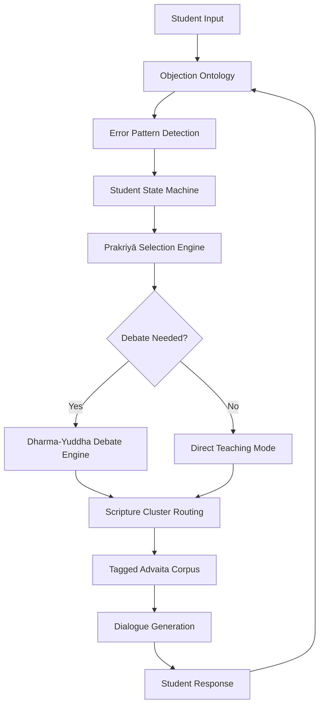

# AIM System Diagram (v1.0)

This diagram shows the full architecture of the **Advaita Inquiry Model (AIM)** and how dialogue flows through the system.

The structure mirrors the traditional Advaita teaching dynamic:
adhikāri → śravaṇa → manana → nididhyāsana → jñāna-niṣṭhā.

---

## System Flow Diagram



---

# System Layers

## 1. Student Interaction Layer

Handles the incoming dialogue.

Components:
- Student Input
- Dialogue Generation

Role:
Interpret the student’s statement and deliver the teaching response.

---

## 2. Diagnostic Layer

Determines what the student is actually expressing.

Components:
- Objection Ontology
- Error Pattern Detection

Role:
Classify the student’s statement into known Advaita error patterns (adhyāsa).

Example:

```
"I experienced Brahman yesterday"
→ error: brahman_objectification
```

---

## 3. Pedagogical Strategy Layer

Selects the teaching method.

Components:
- Student State Machine
- Prakriyā Selection Engine

Role:
Determine which teaching strategy is appropriate based on the student's stage.

Example:

```
error: body_identification
state: śravaṇa
→ prakriyā: dṛg-dṛśya viveka
```

---

## 4. Dialectical Layer

Handles philosophical debate when needed.

Component:
- Dharma-Yuddha Debate Engine

Role:
Execute structured Advaita dialectic based on Śaṅkara’s style.

Example sequence:

```
claim
→ hidden assumption
→ logical consequence
→ contradiction
→ scriptural resolution
```

---

## 5. Knowledge Layer

Provides the actual teaching material.

Component:
- Tagged Advaita Corpus

Includes:

- Upaniṣads
- Śaṅkara prakaraṇa texts
- Supporting Vedānta passages

Each verse is tagged with:

- prakriyā
- ontological operation
- adhikāri suitability
- pedagogical function

---

# Architectural Insight

The AIM system does **not operate like a normal chatbot**.

Instead of:

```
question → answer
```

AIM operates as:

```
statement → diagnosis → teaching strategy → scripture → dialogue
```

This mirrors the **traditional guru–śiṣya pedagogical dynamic**.

---

# Complete AIM Stack

```
Tagged Advaita Corpus
        ↑
Scripture Cluster Routing
        ↑
Dharma-Yuddha Debate Engine
        ↑
Prakriyā Selection Engine
        ↑
Student State Machine
        ↑
Objection Ontology
        ↑
Student Dialogue
```

---

# Architectural Principle

AIM does not attempt to generate Advaita philosophy from scratch.

Instead it:

- diagnoses misunderstanding
- selects a traditional teaching method
- routes to scriptural passages
- delivers context-aware dialogue

In this way the system behaves as a **digital Advaita pedagogue rather than a generic language model**.
